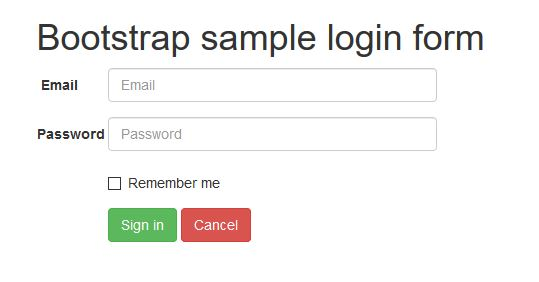
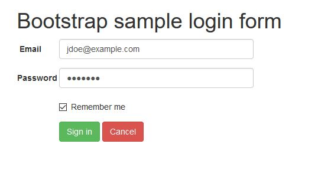
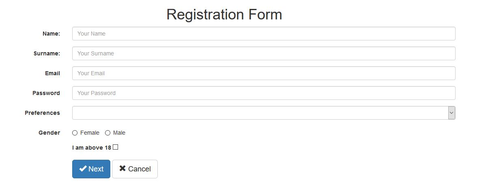
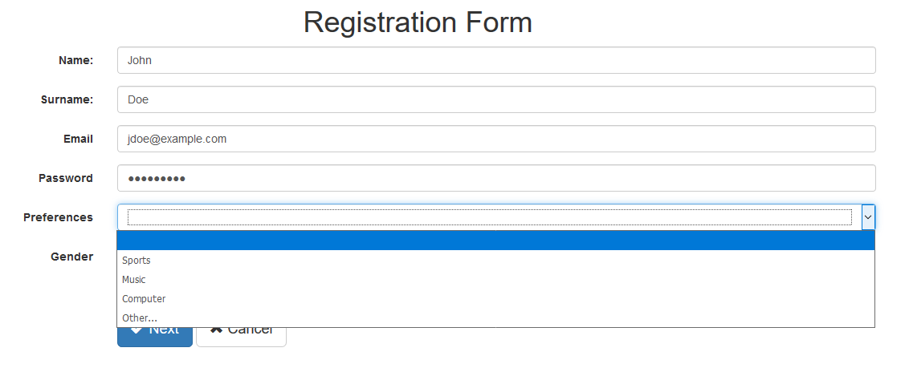

# Intro to Java Servlets

Author: [Sofoklis Stouraitis](mailto:sofos@aueb.gr)


## Course Software

* Download and install latest [Java Development Kit](http://www.oracle.com/technetwork/java/javase/downloads/jdk8-downloads-2133151.html)
* Download and install latest stable release of [Apache Tomcat](http://tomcat.apache.org/) Web Server
* Download and install [Eclipse IDE for Java EE Developers](http://www.eclipse.org/downloads/packages/eclipse-ide-java-ee-developers/neon3)


## What are Servlets?


* A servlet is a Java programming language class used to extend the capabilities of servers that host applications accessed by means of a request-response programming model. Although servlets can respond to any type of request, they are commonly used to extend the applications hosted by web servers. For such applications, Java Servlet technology defines HTTP-specific servlet classes.

    > From the Oracle website

* `Servlets` are `Java classes` that are compiled to byte code that can be loaded dynamically into and run by a Java technology-enabled Web server (supports the Java Servlet specification) or `Servlet container`
* The javax.servlet and `javax.servlet.http` packages provide `interfaces` and `classes` for writing `servlets`.
* `Servlets` have access to the entire family of `Java APIs`, including the `JDBC API` to access databases.
* Using `Servlets`, you can collect input from users through web page forms, present records from a database or another source, and create web pages dynamically.
* Like other Java technology-based components, `servlets` are platform-independent Java classes that are compiled to platform-neutral byte code that can be loaded dynamically into and run by a Java technology-enabled Web server.
* Servlets interact with Web clients via a `request/response` paradigm implemented by the `servlet` container.

**Servlet Containers:** Containers, sometimes called `servlet engines`, are Web server extensions that provide servlet functionality.


## Servlet lifecycle

The lifecycle of a servlet is controlled by the container in which the servlet has been deployed. When a request is mapped to a servlet, the container performs the following steps:

1. If an instance of the servlet does not exist, the web container:
   1. Loads the servlet class
   2. Creates an instance of the servlet class
   3. Initializes the servlet instance by calling the `init` method
2. The container invokes the `service` method, passing `request` and `response` objects in order to handle request from the client. The container calls this method each time when request for the servlet is received.

If it needs to remove the servlet, the container finalizes the servlet by calling the servlet's `destroy` method.

```java
package org.afdemp.bootcamp2.servlets;

import java.io.IOException;
import javax.servlet.ServletException;
import javax.servlet.annotation.WebServlet;
import javax.servlet.http.HttpServlet;
import javax.servlet.http.HttpServletRequest;
import javax.servlet.http.HttpServletResponse;

@WebServlet("/example")
public class ExampleServlet extends HttpServlet {
    private static final long serialVersionUID = 1L;

    protected void doGet(HttpServletRequest request, HttpServletResponse response) throws ServletException, IOException {
        /* code to handle GET requests */
    }

    protected void doPost(HttpServletRequest request, HttpServletResponse response) throws ServletException, IOException {
        /* code to handle POST requests */
    }

}
```


## `@WebServlet`

* Use the `@WebServlet` annotation to define a servlet component in a web application.
* @WebServlet annotation is used to map the servlet with one (or more) URL pattern.
* The annotated `Servlet` must specify at least one URL pattern.
* If the `Servlet` is not annotated a deployment descriptor (`web.xml` file) is required

**Example define a URL Patern**
```java
@WebServlet("/report")
```


**Example define a multiple URL Paterns**
```java
@WebServlet({ "/report", "/viewreport" })
```


## Servlet Methods

### `init()`

The `init` method is designed to be called only once. It is called when the servlet is first created, and not called again for each user request. So, it is used for one-time initializations.

### `service()`

The `service` method is the main method to perform the actual task. The servlet container calls the `service` method to handle requests coming from the client (ex: via a browser).
Each time the server receives a request for a `servlet`, the server spawns a new thread and calls `service`. The `service` method checks the `HTTP request` type (`GET`, `POST`, `PUT`, `DELETE`, etc.) and calls `doGet`, `doPost`, `doPut`, `doDelete`, etc. methods as appropriate.

So you have nothing to do with `service` method but you override either `doGet` or `doPost` etc. depending on what type of request you receive from the client.

### `doGet()`

The `doGet` method handles Http `GET` requests. This method is called everytime the Servlet receives `GET` requests from a client.

A GET request results from:
 * a normal request for a URL
   ```html
   http://www.example.com/example
   ```
 * a request from an HTML form that has no METHOD specified (or GET specified).
   ```html
    <form action="..." method="get">
        ...
    </form>
    ```

### `doPost()`

The `doPost` method handles Http `POST` requests. This method is called everytime the Servlet receives `POST` requests from a client.

A `POST` request results from an HTML form that specifies `POST` as the Method.

```html
<form action="..." method="post">
    ...
</form>
```


## Servlets & Html

```java
// Setting the response content type
response.setContentType("text/html; charset=UTF-8");
```

**Example 1:**

```java
package org.afdemp.bootcamp2.servlets;

import java.io.IOException;
import java.io.PrintWriter;
import javax.servlet.ServletException;
import javax.servlet.annotation.WebServlet;
import javax.servlet.http.HttpServlet;
import javax.servlet.http.HttpServletRequest;
import javax.servlet.http.HttpServletResponse;

/**
 * Servlet implementation class HelloWorldPage
 */
@WebServlet("/hello")
public class HelloWorldPage extends HttpServlet {
	private static final long serialVersionUID = 1L;

	/**
	 * @see HttpServlet#doGet(HttpServletRequest request, HttpServletResponse
	 *      response)
	 */
	protected void doGet(HttpServletRequest request, HttpServletResponse response)
			throws ServletException, IOException {

		// Set response content type
		response.setContentType("text/html; charset=UTF-8");

		PrintWriter out = new PrintWriter(response.getWriter());
		// Print html code
		out.println("<!DOCTYPE html>");
		out.println("<html>");
		out.println("    <head>");
		out.println("        <meta charset='utf-8'>");
		out.println("        <title>Hello World Example</title>");
		out.println("    </head>");
		out.println("    <body>");
		out.println("      <h1>Hello World</h1>");
		out.println("  </body>");
		out.println("</html>");

	}

	/**
	 * @see HttpServlet#doPost(HttpServletRequest request, HttpServletResponse
	 *      response)
	 */
	protected void doPost(HttpServletRequest request, HttpServletResponse response)
			throws ServletException, IOException {
		// TODO Auto-generated method stub
		doGet(request, response);
	}

}


```


**Run in Tomcat:**


## Send Data to Servlet

### Via a URL (Directly)

```html
http://localhost:8080/project-name/servlet-path?parameter1=value1&parameter2=value2&parameter3=value3 etc...
```


### Via an Html form

```html
...
<form action="login" method="post" class="form-horizontal">
    <div class="form-group">
        <label for="email" class="col-sm-2 control-label">Email</label>
        <div class="col-sm-10">
            <input type="email" name="email" class="form-control" placeholder="Email" required>
        </div>
    </div>
    <div class="form-group">
        <label for="password" class="col-sm-2 control-label">Password</label>
        <div class="col-sm-10">
            <input type="password" name="password" class="form-control" placeholder="Password" required>
        </div>
    </div>
    <div class="form-group">
        <div class="col-sm-10 col-sm-offset-2">
            <label class="checkbox-inline"><input type="checkbox" name="rememberme" value="1"> Remember me</label>
        </div>
    </div>
    <div class="form-group">
        <div class="col-sm-10 col-sm-offset-2">
            <button class="btn btn-success" type="submit">Sign in</button>
            <button type="button" class="btn btn-danger" data-dismiss="modal">Cancel</button>
        </div>
    </div>
</form>
...
```

**Display in Browser:**




## Read Data from Servlet

```java
String parameter1 = request.getParameter("form-element1-name");
String parameter2 = request.getParameter("form-element2-name");
...
```


[`request.getParameter(String name)`](https://docs.oracle.com/javaee/7/api/javax/servlet/ServletRequest.html#getParameter-java.lang.String-): Returns the value of a request parameter as a String, or null if the parameter does not exist. Request parameters are extra information sent with the request. For HTTP servlets, parameters are contained in the query string or posted form data.


Read more about the `request`:
* [Interface ServletRequest](https://docs.oracle.com/javaee/7/api/javax/servlet/ServletRequest.html)
* [Interface HttpServletRequest](https://docs.oracle.com/javaee/7/api/javax/servlet/http/HttpServletRequest.html)


**Example:** Reading parameters from http request (login form above) and print them in a html page (Bootstrap):

```java
package org.afdemp.bootcamp2.servlets;

import java.io.IOException;
import java.io.PrintWriter;
import javax.servlet.ServletException;
import javax.servlet.annotation.WebServlet;
import javax.servlet.http.HttpServlet;
import javax.servlet.http.HttpServletRequest;
import javax.servlet.http.HttpServletResponse;

/**
 * Servlet implementation class LoginHandler
 */
@WebServlet("/login")
public class LoginHandler extends HttpServlet {

    private static final long serialVersionUID = 1L;

    /**
     * @see HttpServlet#HttpServlet()
     */
    public LoginHandler() {
        super();
        // TODO Auto-generated constructor stub
    }

    /**
     * @see HttpServlet#doGet(HttpServletRequest request, HttpServletResponse response)
     */
    protected void doGet(HttpServletRequest request, HttpServletResponse response) throws ServletException, IOException {
        doPost(request, response);
    }

    /**
     * @see HttpServlet#doPost(HttpServletRequest request, HttpServletResponse response)
     */
    protected void doPost(HttpServletRequest request, HttpServletResponse response) throws ServletException, IOException {

        /*
         * Gets parameters from request (html form)
         */
        String username = request.getParameter("email");
        String password = request.getParameter("password");
        String remember = request.getParameter("rememberme");

        // Set response content type
        response.setContentType("text/html; charset=UTF-8");

        PrintWriter out = new PrintWriter(response.getWriter());

        // Print html code...
        out.println("<!DOCTYPE html>");
        out.println("<html>");
        out.println("    <head>");
        out.println("        <meta charset='utf-8'>");
        out.println("        <meta http-equiv='X-UA-Compatible' content='IE=edge'>");
        out.println("        <meta name='viewport' content='width=device-width, initial-scale=1'>");
        out.println("        <!-- The above 3 meta tags *must* come first in the head; any other head content must come *after* these tags -->");
        out.println("        <title>Sample Bootstrap form</title>");
        out.println("        <!-- Bootstrap core CSS -->");
        out.println("        <link rel='stylesheet' href='https://maxcdn.bootstrapcdn.com/bootstrap/3.3.7/css/bootstrap.min.css'>");
        out.println("        <!-- HTML5 shim and Respond.js for IE8 support of HTML5 elements and media queries -->");
        out.println("        <!-- WARNING: Respond.js doesn't work if you view the page via file:// -->");
        out.println("        <!--[if lt IE 9]>");
        out.println("          <script src='https://oss.maxcdn.com/html5shiv/3.7.3/html5shiv.min.js'></script>");
        out.println("          <script src='https://oss.maxcdn.com/respond/1.4.2/respond.min.js'></script>");
        out.println("        <![endif]-->");
        out.println("    </head>");
        out.println("    <body>");
        out.println("      <div class='container'>");
        out.println("        <h1>Data from Client</h1>");
        out.println("        <div class='alert alert-info'>");
        out.println("username:" + username + "<br>");
        out.println("password:" + password + "<br>");
        out.println("remember:" + remember);
        out.println("        </div>");
        out.println("      </div><!-- /.container -->");
        out.println("      <!-- JavaScript files before the closing body tag -->");
        out.println("      <script src='https://ajax.googleapis.com/ajax/libs/jquery/1.12.4/jquery.min.js'></script>");
        out.println("      <script src='https://maxcdn.bootstrapcdn.com/bootstrap/3.3.7/js/bootstrap.min.js'></script>");
        out.println("  </body>");
        out.println("</html>");

    } //End of doPost

} //End of class
```


**Run scenario in Tomcat:**




**LoginHandler Response:**


**Add `Html` to `Servlet`**: [Useful Online Tool](http://ism.dmst.aueb.gr/labExercises/htmltoservlet.html)


## Project for Practise

#### Task 1

Create a `Dynamic Web Project` in `Eclipse IDE` with name `servletcourseone`.


#### Task 2

Create a `Html` page with name `registrationform.html` and add a Bootstrap form as in the following figure:

**Registration form:**




**Registration form - Preferences:**




#### Task 3

Create a Servlet with name `RegisterCustomer` that listens to the `/register` URL Path.

The Servlet reads data posted by the form (of the page `registrationform.html`) and prints all data in a Bootstrap table as in the following figure:

**RegisterCustomer Servlet Response:**


## References

* [http://download.oracle.com/otndocs/jcp/servlet-3_1-fr-eval-spec/index.html)
* [https://docs.oracle.com/javaee/7/tutorial/servlets.htm)
* [https://www.tutorialspoint.com/servlets/index.htm)
* [http://o7planning.org/en/10169/java-servlet-tutorial)
* [http://docs.oracle.com/javaee/7/api/index.html)
